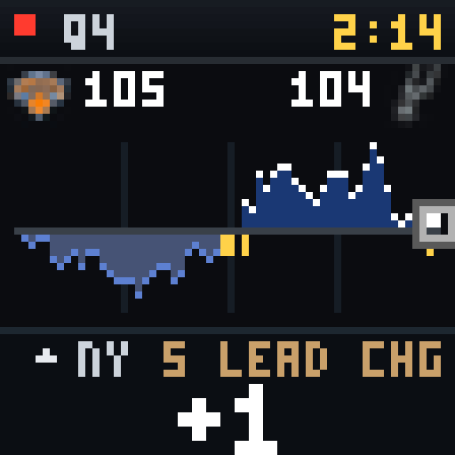
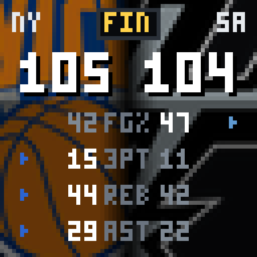
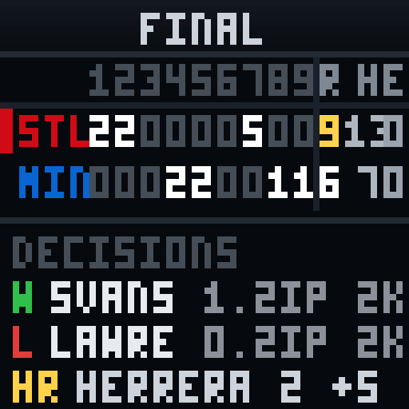
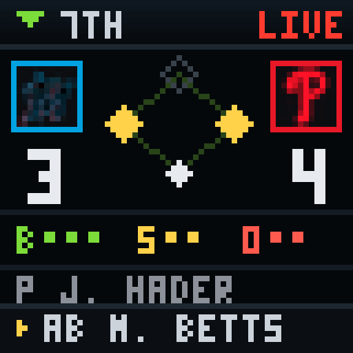
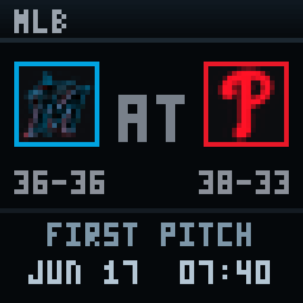
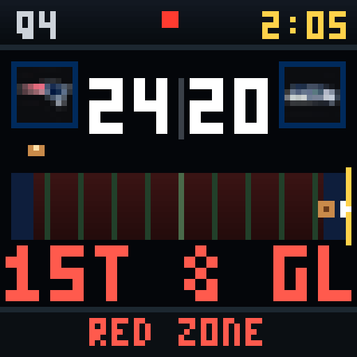

# scoroo

A self-running sports scoreboard for the [Divoom Pixoo 64](https://www.divoom.com/)
(64×64 RGB LED matrix). Polls the public ESPN API, prioritizes the teams you
follow, and renders league-specific pixel-art score cards — momentum charts,
tale-of-the-tape jumbotrons, baseball diamonds, box scores, gridiron field
position — then pushes them to the device over your LAN.

No API keys, no cloud, no account. Just ESPN's public endpoints and a Pi.

## Gallery

Real frames rendered straight from ESPN data (shown 8× — the panel is 64×64).

| | |
|:--:|:--:|
| <br>**NBA live** · momentum (lead-margin flow) | <br>**NBA final** · jumbotron (tale of the tape) |
| <br>**MLB final** · box score (line score + decisions) | <br>**MLB live** · diamond (base/out/count) |
| <br>**MLB pre** · diamond (first pitch) | <br>**NFL live** · gridiron (field position) |

## What it shows

It picks what's on screen with a **tiered selector**, top-down each poll:

1. **Favorites live** — any followed team in play takes over the whole screen.
2. **Finals live** — championship Finals (any team) when no favorite is playing.
3. **Favorites' recent + upcoming** — just-played and about-to-play games for
   your teams, otherwise.

Then each game routes to a layout by sport and state:

| Sport | Live | Final | Pre |
|-------|------|-------|-----|
| **NBA** | `momentum` — lead-margin flow chart, current run, lead changes | `jumbotron` — zoomed-logo tale-of-the-tape + box-score stats | `momentum` card |
| **MLB** | `diamond` — base/out/count, live at-bat | `mlbbox` — full line score (runs by inning + R/H/E) + pitching decisions + HR log | `diamond` — first-pitch time + date |
| **NFL** | `gridiron` — field position, down & distance, red-zone | `gridiron` final | `gridiron` kickoff |

All data is real: play-by-play margins, box-score stats, base/count situation,
scoring leaders, line scores and pitching decisions all come from ESPN's
scoreboard + summary endpoints. Heavier play-by-play pulls are **lazy** — fetched
only for the game actually on screen, and cached (20s live / 30min final).

## Setup

```bash
python3 -m venv venv
./venv/bin/pip install -r requirements.txt   # pillow, requests
cp config.example.json config.json            # then edit device_ip + favorites
./venv/bin/python app.py                       # runs the loop
```

`config.json` is gitignored (it's your local device config) — copy it from
`config.example.json` and set your Pixoo's IP, which you can find via Divoom LAN
discovery:

```bash
curl -s https://app.divoom-gz.com/Device/ReturnSameLANDevice
```

## Config — `config.json`

| Key | Meaning |
|-----|---------|
| `device_ip` | Pixoo IP on your LAN |
| `leagues` | any of `nba nfl mlb nhl epl` |
| `favorites` | team names/abbreviations to prioritize (e.g. `lakers`, `yankees`) |
| `timezone` | IANA tz for displayed game times (e.g. `Asia/Tokyo`) |
| `refresh_live` / `refresh_idle` / `refresh_empty` | adaptive poll intervals (s) — fast while live, slow when idle, very slow when nothing's on |
| `rotate_seconds` | seconds per card before rotating |
| `max_cards` | max games in the rotation |
| `brightness` | `day` / `night` levels + `night_start_hour` / `night_end_hour` |

## How it runs

Deployed as a systemd service (`pixoo-scores.service`) on a Raspberry Pi 5.

```bash
sudo systemctl status pixoo-scores
sudo systemctl restart pixoo-scores
tail -f /var/log/pixoo-scores.log
```

## Notes & quirks

- **The Pixoo's HTTP firmware sustains ~1 fps and drops connections under rapid
  pushes** — so there's no smooth scrolling; the loop pushes one composed frame
  per `rotate_seconds`. When nothing is pushing, the device holds the last frame
  (looks frozen but isn't).
- Rendering uses Pillow with `fontmode="1"` (no antialiasing) plus pixel fonts
  (Press Start 2P, Tiny5) and a custom 3×5 bitmap micro-font for the dense grids.
- ESPN scoreboard responses carry `cache-control: max-age=6`, so ~6s is the data
  floor; the adaptive poller never bursts.
- Each event is parsed in isolation — one malformed ESPN entry is skipped, not
  allowed to drop a whole league's slate.

## Project layout

| File | Role |
|------|------|
| `app.py` | tiered selector + main poll/rotate loop |
| `espn.py` | all ESPN fetching/parsing |
| `render.py` | every layout (`render.LAYOUTS`) |
| `logos.py` | team-logo fetch + cache (`assets/logos/`) |
| `pixoo.py` | Divoom device client |
| `preview.py` | render a scaled sheet to `debug/` without the device |
| `demo_*.py` | on-device A/B testers (run with the service stopped) |
| `docs/` | design concepts the layouts were ported from |
